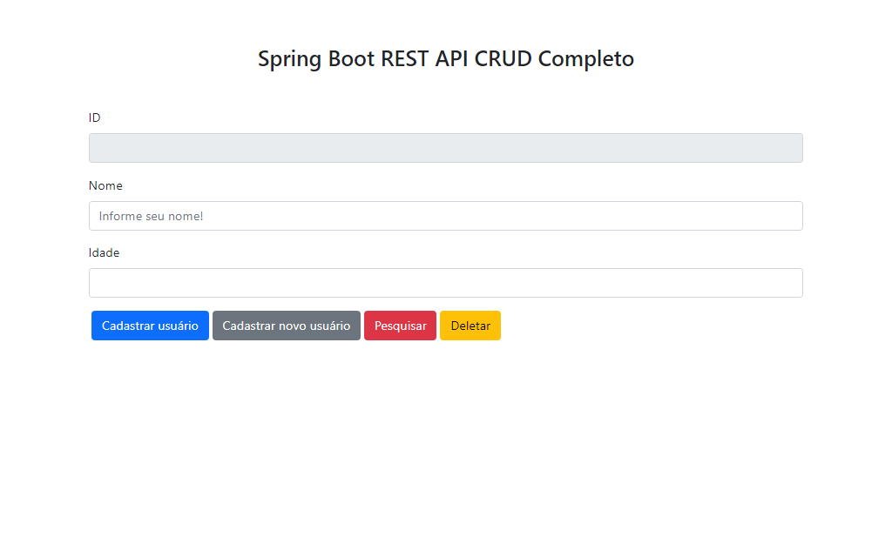
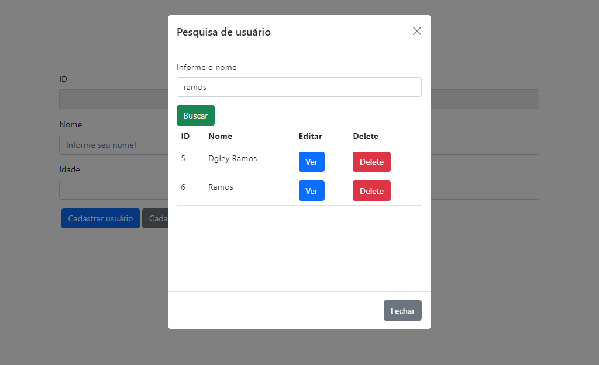

### Spring Boot REST API CRUD Completo

Aplicação para cadastro de usuários

- [x] GET
- [x] POST
- [x] PUT
- [x] DELETE

#### Entidade:

##### Usuario

- id
- nome
- idade

#### Tecnologias:

- [x] Java
- [x] SpringBoot
- [x] Jquery
- [x] Bootstrap
- [x] Html

#### Preview

#### Author

- Dgley Ramos
- [LinkedIn](https://www.linkedin.com/in/dgleyramos/)
- [Instagram](https://www.instagram.com/dgleyramos/)